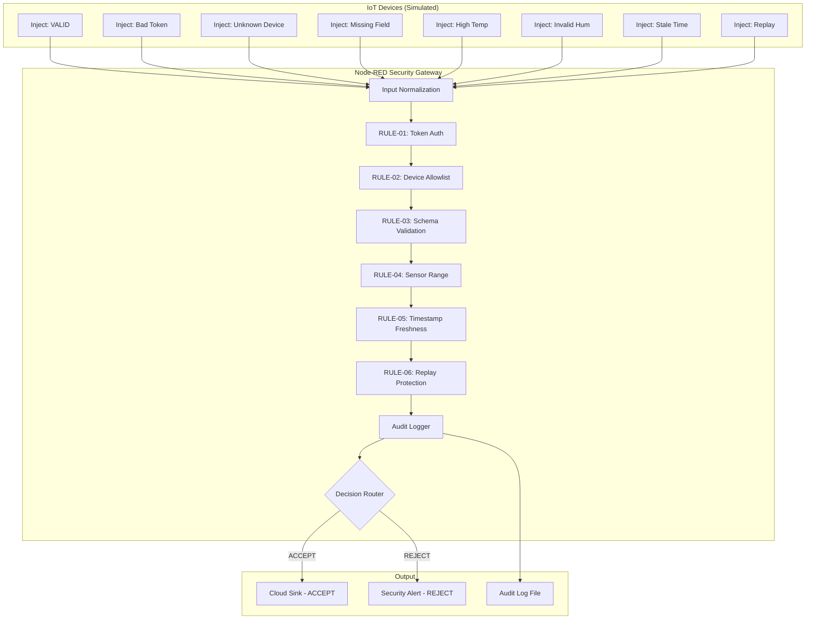

# IoT Security Gateway Lab - Vai trò của Gateway trong Bảo mật IoT

**Mã đề tài:** 04
**Mã sinh viên:** 231A010001
**Họ và tên:** Lương Nguyễn Ngọc Đinh
**Lớp/Học phần:** INT4410 - Bảo mật trong IoT
**Hình thức:** Cá nhân

> **GitHub Repository:** https://github.com/dinhvaren/iot-gateway-security-lab

---

## 1. Giới thiệu

Đề tài xây dựng một **IoT Security Gateway** mô phỏng bằng **Node-RED**, chạy trên **Docker**. Gateway đóng vai trò lớp trung gian kiểm soát dữ liệu từ thiết bị IoT trước khi gửi lên cloud/backend.

### 1.1. Vấn đề bảo mật IoT cần giải quyết

Thiết bị IoT thường gửi dữ liệu trực tiếp tới backend mà không qua lớp kiểm soát trung gian. Hệ thống có thể tiếp nhận:
- Thiết bị giả mạo gửi dữ liệu sai lệch.
- Payload sai cấu trúc gây lỗi backend.
- Dữ liệu cảm biến bất thường (vượt ngưỡng vật lý).
- Dữ liệu bị replay để đánh lừa logic nghiệp vụ.
- Thiếu khả năng truy vết khi xảy ra sự cố.

### 1.2. Vai trò của Gateway

Gateway bảo mật thực hiện **3 vai trò chính**:

1. **Xác thực dữ liệu và thiết bị** - Xác minh danh tính thiết bị trước khi chấp nhận dữ liệu.
2. **Lọc dữ liệu trước khi gửi lên cloud** - Kiểm tra cấu trúc, ngưỡng giá trị, tính hợp lệ về thời gian.
3. **Ghi log và kiểm soát** - Ghi nhận mọi request kèm quyết định và lý do, không lưu secret.

---

## 2. Kiến trúc Hệ thống

### 2.1. Sơ đồ tổng quan



### 2.2. Pipeline xử lý

```
Inject Nodes → Input Normalization → RULE-01 → RULE-02 → RULE-03
→ RULE-04 → RULE-05 → RULE-06 → Audit Logger → Decision Router
                                              ↘ Audit Log File
```

### 2.3. Định dạng Payload

```json
{
  "device_id": "sensor-001",
  "token": "demo-secure-token-2024",
  "timestamp": 2000000000000,
  "temperature": 28.5,
  "humidity": 65
}
```

---

## 3. Các Rule Bảo mật

| Rule | Tên | Mô tả | OWASP ISVS |
|------|-----|-------|------------|
| RULE-01 | Token Authentication | Kiểm tra token thiết bị | ISVS-2.1: Device-to-Gateway Authentication |
| RULE-02 | Device Allowlist | Chỉ chấp nhận thiết bị đã đăng ký | ISVS-2.1: Device Identity & Access Control |
| RULE-03 | Schema Validation | Kiểm tra trường bắt buộc và kiểu dữ liệu | ISVS-3.1: Input Validation |
| RULE-04 | Sensor Range | Giới hạn nhiệt độ [-20,60]°C, độ ẩm [0,100]% | ISVS-3.2: Data Integrity |
| RULE-05 | Timestamp Freshness | Từ chối dữ liệu cũ hơn 5 phút | ISVS-2.3: Time-based Access |
| RULE-06 | Replay Protection | Phát hiện payload trùng lặp | ISVS-2.3: Anti-Replay |
| Audit | Audit Logger | Ghi log cấu trúc cho mọi request | ISVS-4.1: Security Event Logging |

### 3.1. Cấu hình Rule (biến môi trường)

| Biến | Mặc định | Mô tả |
|------|----------|-------|
| `GATEWAY_AUTH_TOKEN` | `demo-secure-token-2024` | Token xác thực thiết bị |
| `GATEWAY_ALLOWED_DEVICES` | `sensor-001,sensor-002` | Danh sách thiết bị hợp lệ |
| `GATEWAY_MAX_TEMP` | `60` | Ngưỡng nhiệt độ tối đa (°C) |
| `GATEWAY_MIN_TEMP` | `-20` | Ngưỡng nhiệt độ tối thiểu (°C) |
| `GATEWAY_MAX_HUMIDITY` | `100` | Ngưỡng độ ẩm tối đa (%) |
| `GATEWAY_MIN_HUMIDITY` | `0` | Ngưỡng độ ẩm tối thiểu (%) |
| `GATEWAY_MAX_AGE_MS` | `300000` | Tuổi dữ liệu tối đa (ms) |

---

## 4. Cài đặt và Chạy

### 4.1. Yêu cầu

- Docker 29+ và Docker Compose 5+
- Trình duyệt web (Chrome/Firefox/Edge)
- curl (để test qua command line)

### 4.2. Các bước cài đặt

```bash
# 1. Clone repository (sau khi có GitHub repo)
git clone <repo-url>
cd iot-gateway-security-lab

# 2. Tạo file .env từ mẫu
cp .env.example .env

# 3. Khởi động Node-RED
docker compose up -d

# 4. Kiểm tra trạng thái
docker compose ps

# 5. Mở Node-RED
# Truy cập http://localhost:1880
```

### 4.3. Import flows (nếu flow chưa được load tự động)

Flows được tự động load từ `node-red/data/flows.json`. Nếu cần import thủ công:
1. Mở http://localhost:1880
2. Ctrl+I (Import)
3. Paste nội dung `flows.json`
4. Chọn "Import to new flow"
5. Deploy

### 4.4. Dừng/Dọn dẹp

```bash
docker compose down        # Dừng container
docker compose down -v     # Dừng và xóa volumes
```

---

## 5. Demo

### 5.1. Demo nhanh qua curl

```bash
# Inject từng test case
curl -X POST http://localhost:1880/inject/inj-valid-001      # TC-01 VALID → ACCEPT
curl -X POST http://localhost:1880/inject/inj-badtoken-002   # TC-02 Bad Token → REJECT
curl -X POST http://localhost:1880/inject/inj-unkdev-003     # TC-03 Unknown Dev → REJECT
curl -X POST http://localhost:1880/inject/inj-misfield-004   # TC-04 Missing Field → REJECT
curl -X POST http://localhost:1880/inject/inj-hitemp-005     # TC-05 High Temp → REJECT
curl -X POST http://localhost:1880/inject/inj-invhum-006     # TC-06 Invalid Hum → REJECT
curl -X POST http://localhost:1880/inject/inj-staletime-007  # TC-07 Stale Time → REJECT
curl -X POST http://localhost:1880/inject/inj-replay-008     # TC-08 Replay → REJECT

# Xem audit log
cat logs/audit.log
```

### 5.2. Demo trực quan (Node-RED Dashboard)

1. Mở http://localhost:1880
2. Mở Debug sidebar (Ctrl+G+D)
3. Click nút Inject của từng node để xem kết quả ACCEPT/REJECT
4. Xem audit log: `cat logs/audit.log`

### 5.3. Kịch bản Demo 60 giây

Xem chi tiết tại [docs/DEMO_60_GIAY.md](docs/DEMO_60_GIAY.md)

### 5.4. Video Demo (Bắt buộc)

Video demo 60-90 giây quay màn hình thực tế lab đang chạy.

- **Hướng dẫn quay:** [docs/HUONG_DAN_QUAY_VIDEO_DEMO.md](docs/HUONG_DAN_QUAY_VIDEO_DEMO.md)
- **Kịch bản lời nói:** [docs/KICH_BAN_VIDEO_DEMO.md](docs/KICH_BAN_VIDEO_DEMO.md)
- **Video:** Sẽ cập nhật sau khi quay (Google Drive / YouTube Unlisted)

---

## 6. Test Cases

| # | Test Case | Input | Expected | Actual | Verdict |
|---|-----------|-------|----------|--------|---------|
| TC-01 | Normal Data | Hợp lệ hoàn toàn | ACCEPT | ACCEPT | ✅ PASS |
| TC-02 | Bad Token | Token sai | REJECT RULE-01 | REJECT RULE-01 | ✅ PASS |
| TC-03 | Unknown Device | device_id lạ | REJECT RULE-02 | REJECT RULE-02 | ✅ PASS |
| TC-04 | Missing Field | Thiếu humidity | REJECT RULE-03 | REJECT RULE-03 | ✅ PASS |
| TC-05 | High Temperature | 85°C | REJECT RULE-04 | REJECT RULE-04 | ✅ PASS |
| TC-06 | Invalid Humidity | 150% | REJECT RULE-04 | REJECT RULE-04 | ✅ PASS |
| TC-07 | Stale Timestamp | Cũ ~22 năm | REJECT RULE-05 | REJECT RULE-05 | ✅ PASS |
| TC-08 | Replay | Trùng TC-01 | REJECT RULE-06 | REJECT RULE-06 | ✅ PASS |

**Tổng kết: 8/8 PASS (100%)**

Chi tiết: [docs/TEST_CASES.md](docs/TEST_CASES.md)

---

## 7. Audit Log

Mỗi request được ghi một dòng JSON:

```json
{
  "event_time": "2026-07-08T03:29:37.994Z",
  "device_id": "sensor-001",
  "token_hint": "demo****",
  "decision": "ACCEPT",
  "rule_id": "PASS",
  "reason": "All gateway checks passed",
  "temperature": 28.5,
  "humidity": 65,
  "timestamp_epoch": 2000000000000,
  "timestamp_age_ms": -216518622004
}
```

- `token_hint`: Token đã mask (chỉ 4 ký tự đầu).
- `decision`: ACCEPT hoặc REJECT.
- `rule_id`: Mã luật quyết định (PASS nếu ACCEPT).

---

## 8. Hạn chế

1. **Token tĩnh:** Không có cơ chế rotate/expire token. Production nên dùng JWT hoặc challenge-response.
2. **Replay protection yếu:** Dựa trên timestamp, dễ bypass bằng cách thay đổi timestamp nhỏ hoặc restart container.
3. **Không có mã hóa:** Dữ liệu và token truyền plaintext. Production cần TLS/DTLS.
4. **Không có rate limiting:** Gateway dễ bị flood. Nên bổ sung RULE-07.
5. **Context in-memory:** Mất trạng thái replay protection khi restart container.
6. **Dữ liệu giả lập:** Không có thiết bị IoT vật lý.
7. **Timestamp tương lai được chấp nhận:** Lab chấp nhận timestamp tương lai do clock skew tolerance.

---

## 9. Hướng Phát triển

1. **RULE-07 Rate Limiting:** Giới hạn số request/giây từ mỗi device.
2. **JWT Authentication:** Thay token tĩnh bằng JWT có thời hạn.
3. **MQTT Integration:** Kết nối gateway với MQTT broker thực tế.
4. **Database Audit Log:** Lưu audit log vào database thay vì file.
5. **TLS Termination:** Thêm mã hóa kênh truyền tại gateway.
6. **Anomaly Detection:** Sử dụng thống kê để phát hiện giá trị bất thường trong ngưỡng.
7. **Web Dashboard:** Xây dựng dashboard giám sát gateway real-time.

---

## 10. Tài liệu Tham khảo

1. [Node-RED](https://github.com/node-red/node-red) - Low-code programming for event-driven applications.
2. [Node-RED Docker](https://github.com/node-red/node-red-docker) - Official Docker image for Node-RED.
3. [OWASP IoT Security Verification Standard (ISVS)](https://github.com/OWASP/IoT-Security-Verification-Standard-ISVS) - IoT security verification standard.
4. [NIST SP 800-183](https://nvlpubs.nist.gov/nistpubs/SpecialPublications/NIST.SP.800-183.pdf) - Network of 'Things'.
5. [IoT Security Foundation Compliance Framework](https://www.iotsecurityfoundation.org/best-practice/iot-security-compliance-framework/) - IoT security compliance.
6. [MQTT v5.0 Specification](https://docs.oasis-open.org/mqtt/mqtt/v5.0/os/mqtt-v5.0-os.html) - OASIS MQTT standard.
7. [NISTIR 8259](https://nvlpubs.nist.gov/nistpubs/ir/2020/NIST.IR.8259.pdf) - IoT Device Cybersecurity Capability Core Baseline.

---

## 11. Cấu trúc Thư mục

```
iot-gateway-security-lab/
├── docker-compose.yml              # Docker Compose configuration
├── .env.example                    # Environment variables template
├── .gitignore                      # Git ignore rules
├── flows.json                      # Node-RED flow definition
├── README.md                       # This file
├── PROGRESS_SUMMARY.md             # Progress summary
├── node-red/data/                  # Node-RED data directory
├── logs/                           # Audit log output
├── docs/                           # Documentation
│   ├── DE_CUONG_TUAN_02.md         # Week 02 proposal
│   ├── KIEN_TRUC_HE_THONG.md       # System architecture
│   ├── PHAN_TICH_BAO_MAT.md        # Security analysis
│   ├── TAI_LIEU_THAM_KHAO.md       # References
│   ├── BANG_RUI_RO.md              # Risk assessment table
│   ├── TEST_CASES.md               # Test cases
│   ├── DEMO_60_GIAY.md             # 60-second demo script
│   └── screenshots/                # Screenshots directory
├── evidence/                       # Runtime evidence
│   ├── docker-compose-ps.txt       # Container status
│   ├── gateway-test-results.txt    # Test audit logs
│   ├── accepted-sample-log.json    # Sample ACCEPT log
│   └── rejected-sample-log.json    # Sample REJECT log
└── report/                         # Report
    └── CapNhatTienDo_Tuan02_...    # Week 02 progress report
```

---

**GitHub Repository:** https://github.com/dinhvaren/iot-gateway-security-lab

*Ngày thực hiện: 08/07/2026*
